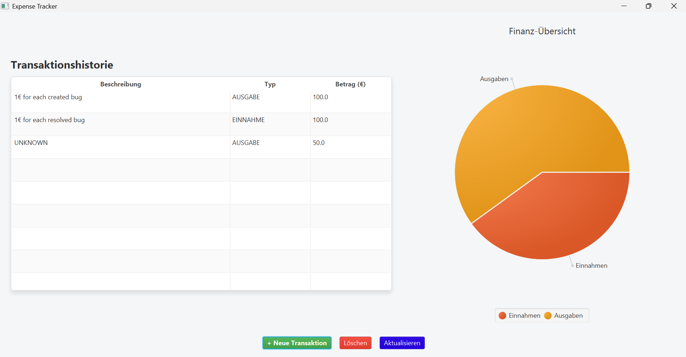
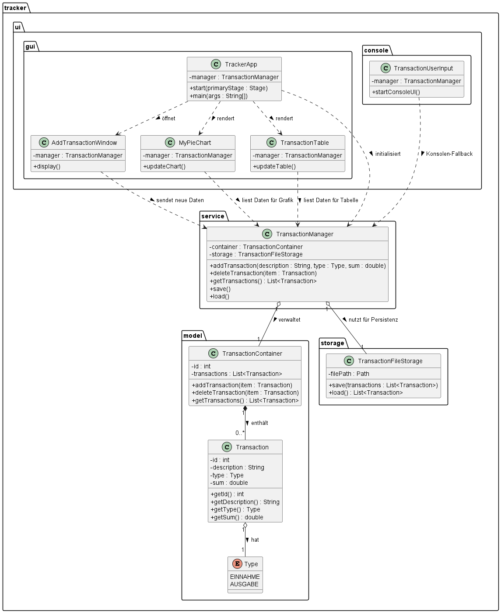

# First-Project: Expense-Tracker

This has been my first learning project to apply my theoretical knowledge as a computer science student at the University of Augsburg. 
It is a simple Transaction Manager that was initially designed as a console-based application and later upgraded with a Graphical User Interface. To ensure clean and maintainable code, I structured the application using the MVC pattern.
It is built with Java and JavaFX, and compiled using Maven. 

### Features
* **Transaction Management:** Add, track, and categorize income and expenses.
* **Data Persistence:** Transactions are saved locally, making sure that no data is lost between sessions.
* **Visual Overview:** A pie chart, that provides a visual breakdown of the financial status.
* **Clean Architecture:** Built with the MVC pattern to separate UI, data, and logic.

### Tech Stack
* **Language:** Java 
* **Framework:** JavaFX
* **Build Tool:** Maven
* **Testing:** JUnit 5

### How to Run
1. Clone this repository to your local machine.
2. Ensure you have a current JDK and Maven installed.
3. Open a terminal in the project's root directory.
4. Compile and launch the application using Maven:
   `mvn clean javafx:run`

